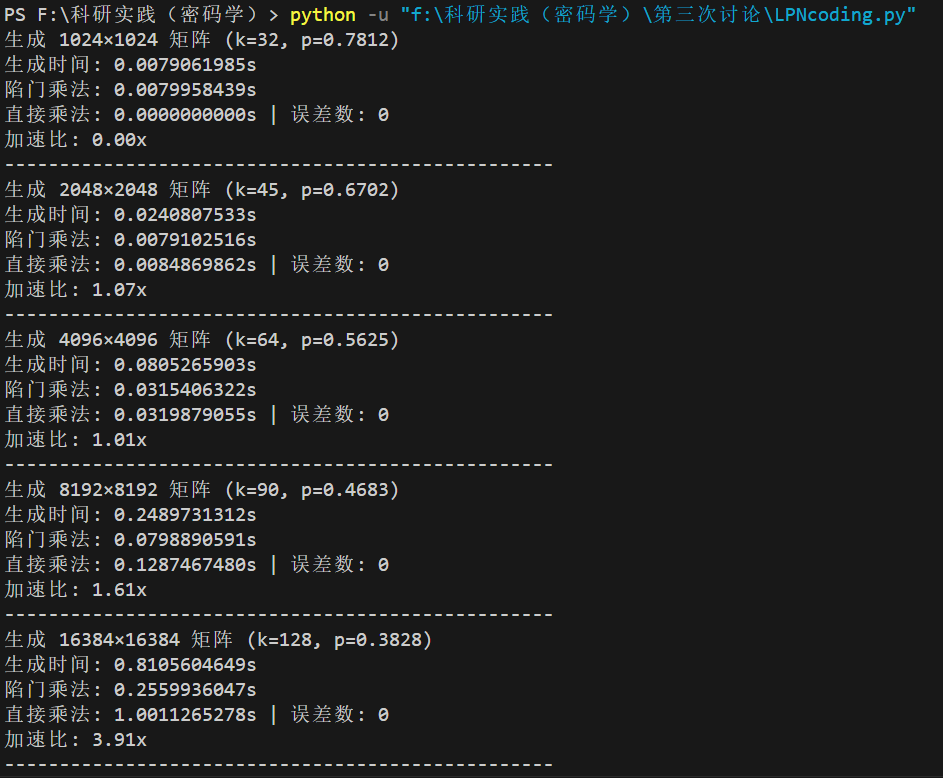
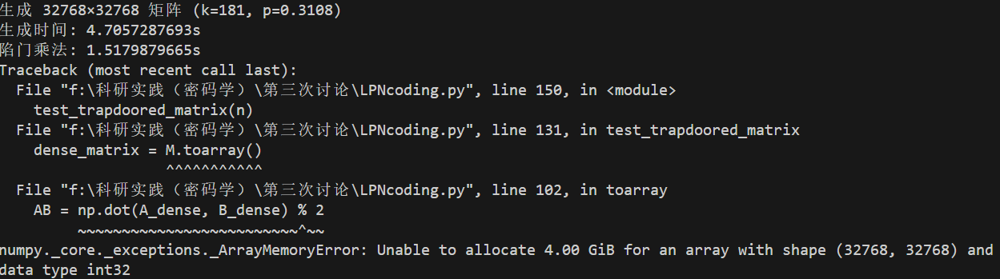
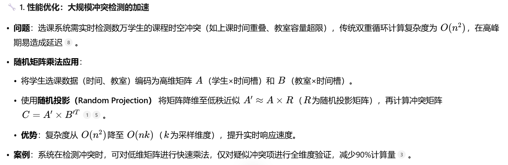

# 8.29
## 一，基于LPN假设编写的pyhton代码以及实验结果

生成时间是生成Trapdoor Matrix的时间，将陷门矩阵转化为普通形式的矩阵需要极大的时间和空间存储
***

## 二，应用方向
1. 大规模冲突检测的加速

2. 推荐算法
__*利用rSVD提取兴趣特征*__
[参考文章](https://link.springer.com/chapter/10.1007/978-3-030-75855-4_10)

3. 加密数据的安全高效计算
__*利用区块链、同态加密技术*__
已有工作：医疗隐私信息利用区块链技术进行传输、计算
[参考文章](https://ieeexplore.ieee.org/abstract/document/11022680)

***
应用于 __选课系统__ 、抢票系统
